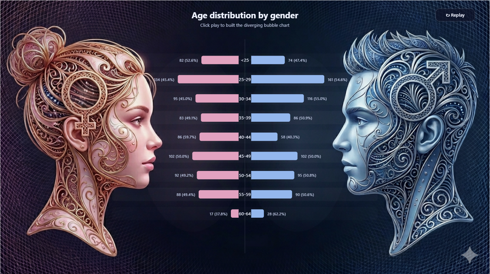

# Bubble to Bar Chart

A sleek Power BI custom visual that transforms bubble charts into interactive bar charts. Great for exploring relationships between multiple dimensions while keeping your dashboard clean and interactive.

## Features

✨ **Interactive & Responsive** – Drill down and explore data effortlessly  
📊 **Customizable Design** – Tailor colors, fonts, and sizing to match your brand  
🎯 **Efficient Encoding** – See multiple dimensions at a glance  
⚡ **Performance Optimized** – Handles large datasets smoothly

## Preview

## Getting Started

### Installation

1. Download the visual from your Power BI organization
2. Add it to your Power BI Desktop report
3. Drag your data fields to the visual's data buckets

### Configuration

Use the formatting pane to adjust:
- **Colors** – Match your brand palette
- **Labels** – Show/hide labels and customize font
- **Sizing** – Scale bubbles and bar dimensions to taste

## Measure Template

Need help getting started? Download the [BubbleToBarMeasure.txt](BubbleToBarMeasure.txt) file for a ready-to-use DAX measure template.

Simply copy the measure into your Power BI model and adapt it to your data structure.

## Use Cases

- **Sales Performance** – Compare regions, teams, and time periods
- **Financial Analysis** – Track metrics across departments and quarters
- **HR Analytics** – Visualize headcount and performance across teams
- **Marketing Metrics** – Analyze campaign performance across channels

## Tips & Tricks

💡 Keep your measure logic simple for best performance  
💡 Use color coding to highlight important segments  
💡 Combine with slicers for powerful filtering

---

Made with ❤️ for data visualization enthusiasts
