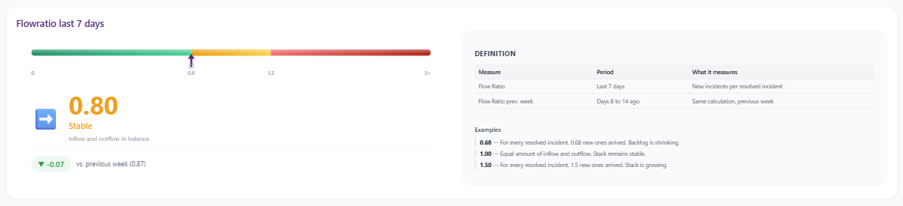
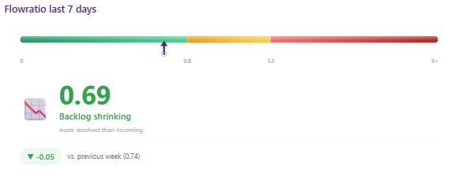
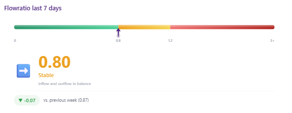
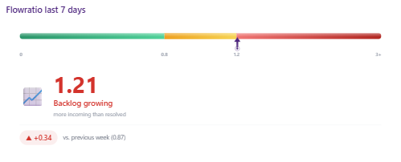

# Flow Ratio KPI Gauge — Power BI Custom Visual

A bespoke HTML/CSS KPI visual for Power BI that gives the Servicedesk Team Manager an instant, real-time pulse check on incident backlog health.

By translating the **Flow Ratio** (new incidents vs. resolved incidents over a trailing 7-day period) into an intuitive color-coded linear gauge, the manager can instantly see whether incoming workload and resolution output are in balance — without digging into dense data tables.



## The Challenge

The Servicedesk Team Manager needed to quickly assess operational health of the ticket queue. Detailed data tables existed for Topdesk Incident Management, but they lacked a high-level operational pulse. The key question: **"Are we good right now?"**

Standard out-of-the-box Power BI visuals fell short of delivering a highly styled, dynamic, and compact linear gauge that could simultaneously display current metrics, historical context (week-over-week trends), definitions, and dynamic behavioral coloring in a single executive-ready view.

## The Solution

A tailored DAX measure that dynamically injects data directly into an integrated HTML/CSS structure, rendered via the Power BI HTML5 Visual.

### Key Features

- **Dynamic Scale Positioning** — Maps the ratio value non-linearly across a tri-colored linear track (Green / Orange / Red)
- **Instant Cognitive Processing** — Dynamically changes colors, titles, descriptions, and icons based on ratio thresholds
- **Week-over-Week Delta** — Badge showing direction and amount of change vs. previous week
- **Integrated Documentation** — Definition panel for seamless end-user onboarding

### Behavioral States

| State | Threshold | Meaning |
|-------|-----------|---------|
| 🟢 Backlog shrinking | < 0.8 | More resolved than incoming |
| 🟠 Stable | 0.8 – 1.2 | Inflow and outflow in balance |
| 🔴 Backlog growing | > 1.2 | More incoming than resolved |

<p align="center">
  
  
  
</p>

## Tech Stack

| Layer | Technology |
|-------|-----------|
| BI Platform | Microsoft Power BI |
| Data Source | Topdesk (Incident Management) |
| Languages | DAX, HTML5, CSS3 |
| Rendering | HTML Content / HTML5 Visual for Power BI |
| Layout | CSS Flexbox, `clamp()` for responsiveness |

## How It Works

The core DAX measure (`flow-ratio-visual.dax`) calculates:

1. **Flow Ratio** — ratio of new incidents to resolved incidents (7-day trailing)
2. **Previous Week Ratio** — same calculation for the prior period
3. **Delta** — week-over-week change with directional indicator
4. **Scale Position** — non-linear mapping to the gauge track
5. **HTML Output** — complete HTML/CSS visual injected as a DAX string

## Usage

1. Add the [HTML Content visual](https://appsource.microsoft.com/en-us/product/power-bi-visuals/WA200001930) to your Power BI report
2. Create a new measure using the code in `flow-ratio-visual.dax`
3. Replace `[FlowRatio]` and `[FlowRatio Vorige Week]` with your own measures
4. Add the measure to the HTML Content visual's "Values" field

## File Structure

```
├── README.md
├── flow-ratio-visual.dax      # Complete DAX measure with embedded HTML/CSS
└── screenshots/
    ├── overview.png            # Full visual with definition panel
    ├── backlog-shrinking.png   # Green state (ratio < 0.8)
    ├── backlog-stable.png      # Orange state (ratio 0.8-1.2)
    └── backlog-growing.png     # Red state (ratio > 1.2)
```

## License

MIT
